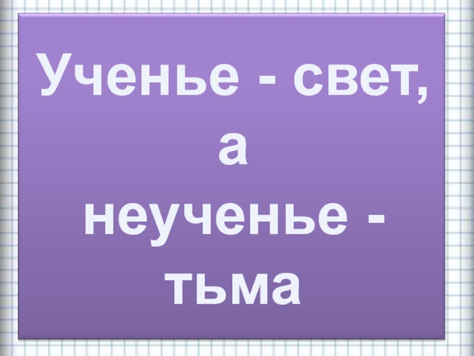

# Основные команды Git (1-го семинара)

> *git init* - инициализация локального репозитория

> *git status* - получить информацию от git о его текущем состоянии

> *git add* - добавить файл или файлы к следующему коммиту

> *git commit -m "message"* - создание коммита

> *git log* - вывод на экран истории всех коммитов с их хеш-кодами

> *git checkout* - переход от одного коммита к другому

> *git checkout master* - вернуться к актуальному состоянию и продолжить работу

> *git diff* - увидеть разницу между текущим файлом и закоммиченным файлом

# Синтаксис языка Markdown

* \# Заголовок - выделение заголовков. Количество символов "#" задаёт уровень заголовка (поддерживается 6 уровней)

* = или - - подчёркиванием этими символами (не менее 3 подряд) выделяют заголовки первого ("=") и второго ("-") уровней

* \** **Полужирное начертание** ** или \__ __Полужирное начертание__ __

* \* *Курсивное начертание* * или \_ _Курсивное начертание_ _

* \*** ***Полужирное курсивное начертание*** ***

* \~~ ~~Зачеркнутый текст~~ ~~

* \* Строка - ненумерованные списки, символ "*" в начале строки

* 1, 2, 3 ... - нумерованные списки

# Основные команды Git (2-го семинара)

> *git branch [branch_name]* - создать ветку под названием branch_name

> *git checkout [branch_name]* - переход к другой ветке

> *git branch -d [branch_name]* - удалить ветку под названием branch_name

> *git merge --abort* - отменить слияние, которое прошло с конфликтом

> *git log --oneline* - коротенький журнал

> *git log --graph* - вывод на экран истории всех коммитов с их хеш-кодами в древовидной форме

